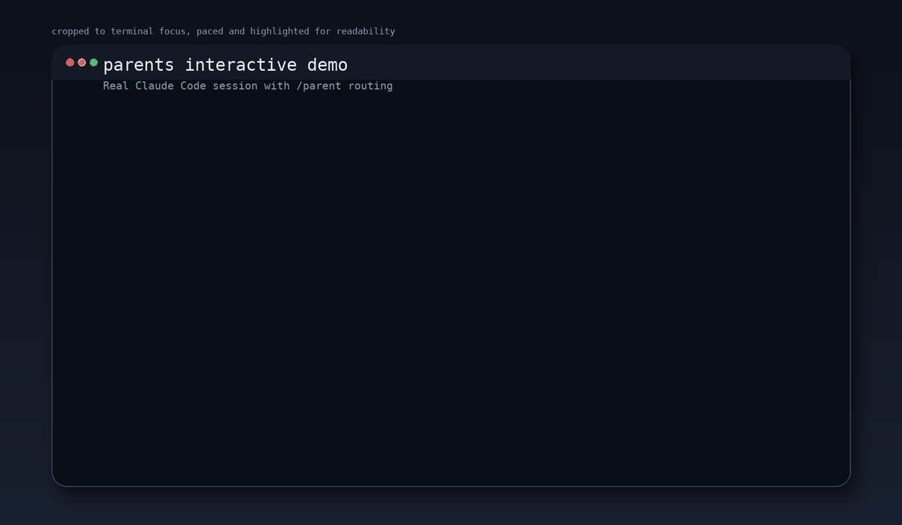

# parents

Project-scoped Claude Code slash commands that automatically choose the right model, mode, and reasoning effort for a request.

## Demo



- MP4: [assets/demo/parent-interactive.mp4](assets/demo/parent-interactive.mp4)
- Session summary: [assets/demo/parent-interactive.txt](assets/demo/parent-interactive.txt)
- Source capture: `assets/demo/source/parent-interactive.{in,out,time}`

The demo assets are rendered from a real interactive `claude` terminal session. The renderer adds crop, pacing, and highlight treatment for readability, but the underlying source comes from an actual Claude Code CLI run.

## English

### Overview

`parents` adds two project-scoped slash commands:

- `/parent`
- `/parent-no-opus`
- `/parent-stats`

Both commands first read the current slash-command arguments from stdin when the wrapper passes them through, fall back to the Claude session transcript when needed, choose an appropriate `model`, `mode`, and `effort`, and then launch one child `claude -p` run.

The user-facing output is intentionally plain. You see a normal Claude response, not an internal routing report.

### Command differences

| Command | Models | Typical use |
| --- | --- | --- |
| `/parent` | `haiku`, `sonnet`, `opus` | General automatic routing |
| `/parent-no-opus` | `haiku`, `sonnet` | Cost-constrained routing with no Opus |
| `/parent-stats` | n/a | Inspect recent routing logs and aggregate outcomes |

### Supported flags

- `--model auto|haiku|sonnet|opus`
- `--mode auto|plan|execute`
- `--effort auto|low|medium|high|max`
- `--why`
- `--dry-run`

`/parent-no-opus` rejects `--model opus`.

`/parent-stats` supports `--limit N|0`, `--date YYYY-MM-DD`, `--since YYYY-MM-DD`, `--until YYYY-MM-DD`, `--window Nd`, `--status ok|failed|dry-run`, `--profile parent|parent-no-opus`, `--mode plan|execute`, `--model haiku|sonnet|opus`, `--confidence high|medium|low`, `--format text|tsv|json`, `--reasons-only`, `--fail-if-empty`, `--summary-only`, `--show-paths`, and `--sort newest|oldest`.

### Installation

This repository is currently project-scoped.

1. Open this folder in Claude Code.
2. Claude Code discovers the custom commands in `.claude/commands/`.
3. Start `claude` in this directory and run one of the commands below.

### Usage examples

Interactive:

```bash
claude
/parent fix the flaky multi-file integration test
/parent-no-opus --dry-run Design a new authentication architecture with migration planning
/parent-stats --window 7d --summary-only --show-paths --sort oldest --limit 0
```

One-shot:

```bash
claude -p '/parent --dry-run rename one variable'
claude -p '/parent --why fix the flaky multi-file integration test'
claude -p '/parent-no-opus --dry-run Design a new authentication architecture with migration planning'
claude -p '/parent-stats --window 7d --summary-only --show-paths --sort oldest --limit 0'
```

### How routing works

- Low-risk, bounded work may use `haiku`.
- Normal implementation defaults to `sonnet`.
- High-risk, broad, architectural, migration, or research-heavy requests go to `plan`.
- `/parent-no-opus` handles Opus-class tasks by staying on `sonnet` and preferring `plan`.
- There is no execution fallback or retry. One route is chosen and executed once.

### Logging

Every run writes:

- JSON metadata to `.parent/runs/YYYY-MM-DD/*.json`
- Markdown summaries to `.parent/runs/YYYY-MM-DD/*.md`

The logs include the original request, selected model/mode/effort, confidence, reason codes, child exit status, and stderr summary.

Inspect recent routing history quickly:

```bash
python3 scripts/parent_stats.py --limit 10
python3 scripts/parent_stats.py --date 2026-04-10 --profile parent-no-opus --mode execute --model sonnet --confidence medium --status failed --limit 20 --format tsv
python3 scripts/parent_stats.py --date 2026-04-10 --model opus --reasons-only --format json --limit 20 --fail-if-empty
python3 scripts/parent_stats.py --date 2026-04-10 --summary-only --limit 20
python3 scripts/parent_stats.py --date 2026-04-10 --summary-only --show-paths --limit 20
python3 scripts/parent_stats.py --date 2026-04-10 --summary-only --show-paths --sort oldest --limit 20
python3 scripts/parent_stats.py --since 2026-04-10 --summary-only --show-paths --sort oldest --limit 20
python3 scripts/parent_stats.py --window 7d --summary-only --show-paths --sort oldest --limit 0
```

The stats report also aggregates `reason_codes`, so you can see which routing rules fired most often across recent runs.

Use `--format tsv` when you want machine-friendly rows for spreadsheets or quick external analysis.

Use `--reasons-only` when you want just the aggregated routing triggers without the full recent-run listing.

Use `--format json` when downstream automation wants structured keys instead of text or TSV rows.

Use `--summary-only` when you want the aggregate counters without the recent-run detail block.

Use `--fail-if-empty` when scripts should treat an empty filtered result set as a failure instead of a successful no-op.

Use `--show-paths` when you need to know exactly which JSON log files contributed to the current filtered report.

Use `--since YYYY-MM-DD` when you want a lower date bound instead of inspecting a single day or the full history.

Use `--window Nd` when you want a recent rolling day window without calculating exact calendar bounds yourself.

Use `--limit 0` when you want the full filtered result set without truncation.

Use `--sort oldest` when you want the earliest matching logs first instead of the default newest-first behavior.

### Development

```bash
python3 -m unittest discover -s tests -v
python3 -m py_compile scripts/parent.py scripts/build_demo.py scripts/capture_interactive_demo.py scripts/render_interactive_demo.py tests/test_parent_router.py tests/test_demo_renderer.py
```

### Demo assets

The repository includes:

- `assets/demo/parent-interactive.gif`
- `assets/demo/parent-interactive.mp4`
- `assets/demo/parent-interactive.txt`
- `assets/demo/source/parent-interactive.in`
- `assets/demo/source/parent-interactive.out`
- `assets/demo/source/parent-interactive.time`
- `scripts/build_demo.py`
- `scripts/capture_interactive_demo.py`
- `scripts/render_interactive_demo.py`

Rebuild the full interactive demo:

```bash
python3 scripts/build_demo.py
```

Re-render from an existing capture:

```bash
python3 scripts/build_demo.py --skip-capture
```

Capture only:

```bash
python3 scripts/capture_interactive_demo.py
```

Render only:

```bash
python3 scripts/render_interactive_demo.py
```

## 한국어

### 개요

`parents`는 Claude Code에 두 개의 프로젝트 스코프 slash command를 추가한다.

- `/parent`
- `/parent-no-opus`
- `/parent-stats`

두 명령 모두 wrapper가 인자를 넘겨주면 먼저 stdin에서 현재 slash-command 인자를 읽고, 필요할 때만 Claude 세션 transcript를 fallback으로 사용한 뒤, 적절한 `model`, `mode`, `effort`를 선택하고 child `claude -p`를 정확히 한 번 실행한다.

사용자에게는 라우팅 리포트를 노출하지 않는다. 결과는 일반적인 Claude 응답처럼 보이게 유지한다.

### 명령 차이

| 명령 | 사용 가능한 모델 | 권장 용도 |
| --- | --- | --- |
| `/parent` | `haiku`, `sonnet`, `opus` | 일반 자동 라우팅 |
| `/parent-no-opus` | `haiku`, `sonnet` | Opus 없이 비용을 통제하는 라우팅 |
| `/parent-stats` | 해당 없음 | 최근 라우팅 로그를 빠르게 집계해서 확인 |

### 지원 플래그

- `--model auto|haiku|sonnet|opus`
- `--mode auto|plan|execute`
- `--effort auto|low|medium|high|max`
- `--why`
- `--dry-run`

`/parent-no-opus`는 `--model opus`를 허용하지 않는다.

`/parent-stats`는 `--limit N`과 `--date YYYY-MM-DD`를 지원한다.

### 설치 방법

현재는 프로젝트 스코프로 동작한다.

1. 이 폴더를 Claude Code에서 연다.
2. Claude Code가 `.claude/commands/` 아래 커스텀 명령을 자동 인식한다.
3. 이 디렉터리에서 `claude`를 실행한 뒤 아래 명령을 사용한다.

### 사용 예시

인터랙티브:

```bash
claude
/parent fix the flaky multi-file integration test
/parent-no-opus --dry-run Design a new authentication architecture with migration planning
/parent-stats --limit 5
```

원샷:

```bash
claude -p '/parent --dry-run rename one variable'
claude -p '/parent --why fix the flaky multi-file integration test'
claude -p '/parent-no-opus --dry-run Design a new authentication architecture with migration planning'
claude -p '/parent-stats --date 2026-04-10 --limit 20'
```

### 라우팅 규칙

- 작고 저위험인 작업은 `haiku`로 갈 수 있다.
- 일반적인 구현 작업은 기본적으로 `sonnet`을 사용한다.
- 고위험, 광범위, 아키텍처, 마이그레이션, 리서치 성격의 요청은 `plan`으로 올린다.
- `/parent-no-opus`는 원래 Opus급인 작업도 `sonnet`으로 유지하고 `plan`을 우선한다.
- 실행 fallback이나 자동 재시도는 없다. 한 번 결정하고 한 번만 실행한다.

### 로그

모든 실행은 다음 경로에 기록된다.

- JSON 메타데이터: `.parent/runs/YYYY-MM-DD/*.json`
- Markdown 요약: `.parent/runs/YYYY-MM-DD/*.md`

기록에는 원문 요청, 선택된 모델/모드/effort, confidence, reason codes, child 종료 상태, stderr 요약이 포함된다.

최근 라우팅 기록을 빠르게 보려면:

```bash
python3 scripts/parent_stats.py --limit 10
python3 scripts/parent_stats.py --date 2026-04-10 --limit 20
```

### 개발용 검증

```bash
python3 -m unittest discover -s tests -v
python3 -m py_compile scripts/parent.py scripts/build_demo.py scripts/capture_interactive_demo.py scripts/render_interactive_demo.py tests/test_parent_router.py tests/test_demo_renderer.py
```

### 데모 자산

저장소에는 다음 파일이 포함된다.

- `assets/demo/parent-interactive.gif`
- `assets/demo/parent-interactive.mp4`
- `assets/demo/parent-interactive.txt`
- `assets/demo/source/parent-interactive.in`
- `assets/demo/source/parent-interactive.out`
- `assets/demo/source/parent-interactive.time`
- `scripts/build_demo.py`
- `scripts/capture_interactive_demo.py`
- `scripts/render_interactive_demo.py`

전체 인터랙티브 데모를 다시 만들려면:

```bash
python3 scripts/build_demo.py
```

기존 캡처로 다시 렌더링만 하려면:

```bash
python3 scripts/build_demo.py --skip-capture
```

캡처만 다시 하려면:

```bash
python3 scripts/capture_interactive_demo.py
```

렌더만 다시 하려면:

```bash
python3 scripts/render_interactive_demo.py
```
